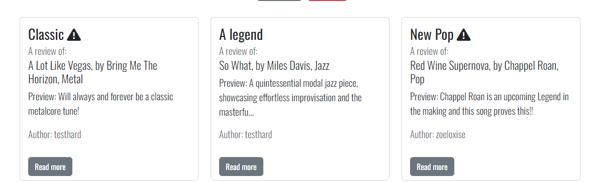

## **Vibe Verdicts**

[View the deployed project here](https://music-review-2e0269d207cf.herokuapp.com/)

## **Site Overview**

Vibe Verdicts is an online application for music lovers to read and post reviews of their favourite music, or new music they have found. Users are able to see limited features of the site until they register an account, but when registered they are able to create, edit and delete their own reviews quickly and easily.

## **Table of contents** 

- [**Vibe Verdicts**](#vibe-verdicts)
- [**Site Overview**](#site-overview)
- [**Table of contents**](#table-of-contents)
- [**Planning stage**](#planning-stage)
  - [**Target Audiences**](#target-audiences)
  - [**User Stories**](#user-stories)
  - [**Site Aims**](#site-aims)
  - [**Wireframes**](#wireframes)
  - [**Color Scheme**](#color-scheme)
- [**Typography**](#typography)
- [**Features**](#features)
- [**Future Enhancements**](#future-enhancements)
- [**Testing Phase**](#testing-phase)
  - [**Responsiveness**](#responsiveness)
  - [**Functionality**](#functionality)
  - [**Validators**](#validators)
  - [**Lighthouse**](#lighthouse)
  - [**Testing user stories**](#testing-user-stories)
- [**Bugs**](#bugs)
- [**Deployment**](#deployment)
- [**Tech**](#tech)
- [**Credits**](#credits)
  - [**Content**](#content)
  - [**Media**](#media)

## **Planning stage**

### **Target Audiences**

- Users with an interest or love of any music
- Users who attend music festivals
- Users looking for new music to listen to
- Users thinking about getting into other genres of music

### **User Stories**

- As a user, I want the site to be easy to use.
- As a user, I want to the site to be responsive.
- As a user, I want the ability to read reviews posted by other users.
- As a user, I want the ability to post new reviews.
- As a user, I want the ability to read my own reviews.
- As a user, I want the ability to edit my own reviews.
- As a user, I want the ability to delete my own reviews.
- As a user, I want the ability to search for reviews by song or artist name.
- As a user, I want the ability to create an account.

### **Site Aims**

- Offer a simple to use application where users can create, read, edit and delete music reviews.
- Offer the ability to register an account, alloweing the user to see and manage their own reviews on a single page.
- To keep the user informed as they create, edit and delete reviews with confirmation of each step.
- To allow the user to search for reviews quickly and easily.

### **Wireframes**

Wireframes are all based on a central responsive design using bootstrap, so only desktop wireframes have been provided.

PLACEHOLDER WIREFRAME IMAGES NEEDED

### **Color Scheme**

Navbar and footer background #212529 Dark Grey
 
Secondary buttons: #6c757d Light grey
 
Supporting text: #585c5f Grey
 
Footer text: #9a9d9e Grey

The [WCAG Color Contrast Checker](https://accessibleweb.com/color-contrast-checker/) was used to ensure the grey text against the dark grey background met accessibility standards. All results passed, except for the small text in the AAA test. However, it was deemed acceptable, as the criteria for AAA compliance are exceptionally stringent and are rarely met.

## **Typography**

I decided to import the Oswald font from Google Fonts as I felt it had a modern vibe to it without compromising on readability. It's stylish, clear to read and worked well with all of the applications features.

## *Features**

**Features common to all pages**

Navigation - The navbar appears on every page of the application. However, the links shown in the image only appear when the user is logged in. If the user is not logged in, they will see Home, Login and Register. The nav bar is fully responsive and collapses inside of a 'burger' icon on smaller devices. If the user wishes to logout, they are prompted with a confirmation modal to ensure they didn't press it by mistake.

This feature helps the user as it gives them a clear, easy way to navigate around the website and find what they need.

Footer - The footer sticks to the bottom of the page, regardless of the page height, so on shorter pages, there is no white gap at the bottom of the page. It includes a contact email address if the user wishes to get in touch with Vibe Verdicts, and also links to their social media accounts. The colour scheme is consistent with the navbar to provide an aesthetic look.

This feature helps the user as they are able to get in touch with the website owner and look for more information and content on their social media accounts.

Flash messages - Flash messages, such as 'You are logged out. Bye for now!'  and various others are set to appear in the same place on every page (only when required/prompted via the app.py file). They appear above the first main heading of the page, below the nav bar, to keep consistency.

This feature helps the user as it keeps them informed as they navigate through and use the website. It also provides confirmation when they ask the website to perform a certain action, reassuring them that what they intended to happen, did in fact happen.

**Home Page**

Main crowd image - This is the first feature the user sees when they enter the website. It immediately fits the theme of the website, as it depicts a crowd at a live show gig. If the user isn't logged in, they see the register button and also a login prompt below if they already have an account. If the user is logged in, the button changes to 'Browse Reviews' and the login prompt is removed.

This feature helps the user because they have a quick way to register for an account and start reading and posting reviews if they haven't already registered, and also provides a quick way to browse reviews if they are logged in.

Home welcome text - This is the next section the user sees on the home page. It's a basic explanation of the website with some instructions how to get the most out of it. It also nicely separates the large image above from the recent reviews cards below it. This feature helps the user as it informs them what they need to do to get the most out of the website.

Recent reviews - This feature displays three randomly selected reviews stored in the database. If the user is logged in, they can click the read more button to be taken to the specific page of that review, however if the user is not logged in, the button does not appear, as this section is for registered users only. If there are no reviews found in the database, a message displays to tell the user no reviews have been found

This feature helps the user as it gives them a preview of the reviews on offer, which should help them decide if they wish to see more.

**Reviews Page**

Search box - This feature allows users to search for songs or artists, rather than scrolling through all of the reviews. The feature includes a reset button, so if the user has searched for something but wishes to reset the process, they are returned to the reviews page where they started.

This feature helps the user as they can easily find a specific song or artist if they are looking for a particular one and saves them a lot of time scrolling through and reading a list of reviews, when the website can do it for them.

All reviews - Below the search box, all reviews found in the database are neatly displayed. If no reviews can be found, a message is displayed to inform the user, with a prompt to be the first one to post a review. If a review belongs to a particular user, they will see the edit and delete buttons, otherwise they will only see read more, which directs them to the page for that specific review.

If the review content is above 90 characters, the preview is capped at this amount with trailing dots, to show there is more to read by clicking on read more. If the content is below 90 characters, the content is shown in the preview as normal.

The ! tooltip is displayed if a user selects that the song contains explicit language when creating their review. When hovered over, it displays the relevant message to warn the user. If the user wishes to delete a review, they are prompted with a confirmation modal to ensure they didn't press it by mistake.

This feature helps the user as it's the main reason they are here, to read reviews! It's a neatly structured grid system, including a consistent design throughout every review, and offers the ability to read reviews further if they are interested.

**New Review Page**

New Review form - This form is used to create a new review. The genre is a dropdown, which is populated by the genres pulled from the database. The song name, artist name and review title input fields include validation to allow a max length of 60 characters as this is long enough to describe the song, artist and provide a short & sharp title. Without it, the user could enter unlimited characters which could make the other pages messy where review previews are shown.

An info message was only included for the review title explaining this because people are more likely to use more than 60 characters for a title than the song and artist name. I also found that too many instruction messages were too much on one page. If the user chooses that a song does include explicit language, a tooltip / warning appears in the relevant place with the review to inform the other users reading it.

The review content is a large text box, where the user can type as much as they want as this is cut down on the review previews elsewhere on the website, however it's only shown at full length on the reviews specific page, which has plenty of room for an endless amount of content.

This feature helps the user as it allows them to get involved with the website and its users, by creating their own reviews and sharing their own thoughts on any particular genre.

**Profile Page**

Profile welcome message - This is a basic welcome message for the user when logged in and viewing their profile. The profile page is where the user lands when they register or login to their account. The message is populated with their username to give a more personal touch. This feature helps the user as it gives them confidence that the page is specific to them and will show more relevant information to their account, as opposed to everyone else's.

Profile reviews -  This is where any reviews the particular user has created are displayed. They are prompted with the same read, edit and delete buttons for each review as they see on the main reviews page. If they haven't created any reviews yet, they are shown a message to confirm this along with a prompt to create their first review. This feature helps the user as it allows them to narrow the reviews on the website down to their own reviews, so they can see what they have created all in one place.

**Edit Review Page**

Edit review form - This form is a replica of the new review form, however it is populated with the existing review details which can be altered as needed. To save the changes, the user clicked edit review and the website and database are updated simultaneously. If they change their mind and wish to go back, there is a button for this also which takes them back to the main reviews page. The app.py file includes logic to stop users trying to hack into other users reviews that don't belong to them. If the user in session doesn't match the user who created the review, a flash message appears to tell them it is not their review and they are unable to edit it.

This feature helps the user as it allows them to update their reviews if they made a mistake or had a change of heart and wish to change their opinion on a particular song.

PLACEHOLDER FOR EDIT REVIEW

**Review Details Page**

Review details -  This is the page where the specific review selected is displayed in full. It includes all of the relevant details filled in when creating a review. If the user chooses that the song includes explicit language a red warning alert appears at the bottom which can't be missed. If the review belongs to the user logged in, they are also shown the edit and delete buttons. Otherwise, the user only sees the back to reviews button, for when they are done reading.

This feature helps the user as it allows them to read a single review and especially helps for longer reviews where the review content is quite long.

**Login Page**

Login form - This form allows the user to login to their account. If they haven't created one, a prompt to register an account is included below. They must enter a username and password that matches that of a record in the database or they are shown a flash message to tell them the details are incorrect. Once the user is logged in, they are in session which prompts the changes and features to appear throughout the site mentioned above.

This feature helps the user as it allows them to log in to their account if they have one and manage their own reviews. They also gain access the full features of the website.

**Register Page**

Register form - This form allows the user to register for an account if they don't already have one. If they already have an account, a prompt is displayed underneath the form where they can login. When registering for an account, the user must follow the validation requirements, clearly explained underneath each input. If they don't, they are told to follow the requirements when they try to register.

The form includes a confirm password input, and the website compares the two to ensure they are the same before the user is registered. If they are not the same, they are told this is the case and that they need to try again.

This feature helps the user as it allows them to become part of the website and begin creating and reading reviews.

## **Future Enhancements**

- An admin account could be added in future, with the relevant code to allow the admin to have full access to the application, including the ability to edit and delete all reviews, regardless if the review was created by the admin account itself.
- Users could be asked as part of the register process what their favourite music genre is, and a suggested reviews section could be introduced showing reviews of that genre which may be of more interest to them than any other.
- A voting/scoring system could be introduced so that users can 'like' a review, with the total likes showing on the review card. Reviews could then be sorted by popularity/likes.
- By also obtaining the users email address, a forgot password function could be added allowing the user to reset their password if they forget their old one.

## **Testing Phase**

### **Responsiveness**

Responsiveness was checked and worked as intended with the following browsers and screen sizes:

- Extra Large (27"):

  - Chrome
  - Safari
  - Firefox

- Large (15"):

  - Chrome
  - Firefox
  - Safari

- Medium (10.9"):

  - Chrome
  - Safari
  - Firefox

- Small (6"):

  - Chrome
  - Safari
  - Firefox

  DevTools was also used to check the responsiveness at various screen sizes and devices from the list of devices available. All were fully responsive and caused no issues.

  ### **Functionality**

Manual testing as a logged **OUT** user

Feature/Test                                                                       | Expected Outcome.                                                                                                                                                  | Result |
| -------------------------------------------------------------------------------- | ------------------------------------------------------------------------------------------------------------------------------------------------------------------ | ------ |
| Navbar layout                                                                    | Only able to see and click home, login and register                                                                                                                | Pass  |
| Logo in Navbar                                                                   | Redirect to Homepage                                                                                                                                               | Pass  |
| Nav links                                                                        | Redirect to the relevant pages                                                                                                                                     | Pass  |
| Home page, register here button                                                  | Redirect to the register page                                                                                                                                      | Pass  |
| Home page, recent reviews                                                        | To change each time on refresh, if more than 3 reviews are found                                                                                                   | Pass  |
| Footer, email link                                                               | Start a new email to Riff Review                                                                                                                                   | Pass  |
| Footer, social media links                                                       | Redirect to relevant social media pages                                                                                                                            | Pass  |
| Login Page, login form match                                                     | When user account exists in database and details entered match, logs user in and shows profile page                                                                | Pass  |
| Login Page, login form non match                                                 | When user details don't match any user accounts stored in the database, flash message should appear to explain                                                     | Pass  |
| Login Page, register link                                                        | Redirect to the register page                                                                                                                                      | Pass  |
| Register Page, register form success                                             | When user completes all fields following the instructions given and clicks register, automatically logs user in and shows profile page                             | Pass  |
| Register Page, register form existing username                                   | When user attempts to register with username that already exists, no registration recorded and flash message to appear to inform user                              | Pass  |
| Register Page, register form unsuccessful                                        | If user doesn't complete all required fields, or follow instructions given, or if passwords don't match, alert/flash appears to explain and they must try again    | Pass  |
| Register Page, login link                                                        | Redirect to the login page                                                                                                                                         | Pass  |
| Reviews, new review, edit review, delete review, review details, profile pages   | Trying to access these pages while not logged in should inform the user they must be logged in                                                                     | Pass  |

Manual testing as a logged **IN** user

Feature/Test                                                                       | Expected Outcome.                                                                                                               | Result |
| -------------------------------------------------------------------------------- | ------------------------------------------------------------------------------------------------------------------------------- | ------ |
| Navbar layout                                            | Login and register buttons removed. Reviews, new review, profile and logout added                                                                       | Pass  |
| Logo in Navbar                                           | Redirect to Homepage                                                                                                                                    | Pass  |
| Nav links                                                | Redirect to the relevant pages                                                                                                                          | Pass  |
| Home Page, Browse Reviews button                         | Redirect to reviews page                                                                                                                                | Pass  |
| Home Page, recent reviews refresh                        | To change each time on refresh if more than 3 reviews are found                                                                                         | Pass  |
| Home Page, recent reviews read more buttons              | For any reviews shown, read more button should display                                                                                                  | Pass  |
| Reviews page, new search with results found              | When search is clicked, reviews below are narrowed down to the result(s) found                                                                          | Fail |
| Reviews page, new search with no results found           | When search is clicked, all reviews disappear with a message informing the user                                                                         | Fail  |
| Reviews page, reset button                               | When clicked, redirect to the reviews page, therefore resetting the process / refreshing the page                                                       | Pass  |
| Reviews page, post review button                         | When no search results are found, ‘post the first one’ button to appear and redirect to new_review page when clicked                                    | Pass  |
| Reviews page, reviews section                            | Show all reviews found in database with read more button redirecting to the page for that review when clicked                                           | Pass  |
| Reviews page, reviews belonging to a user                | If any reviews belong to the logged in user, edit and delete buttons should appear.                                                                     | Pass  |
| Reviews page, edit review button                         | Redirect to edit_review page                                                                                                                            | Pass  |
| Reviews page, delete review button                       | Open delete_review modal                                                                                                                                | Pass  |
| Reviews page, delete review modal                        | Go back closes the modal, delete review removes the review completely and redirects to reviews page                                                     | Pass  |
| New Review page, all fields required                     | All input fields must be completed/selected prior to submitting a review                                                                                | Pass  |
| New Review page, song name, artist name & review title   | Both input fields should have a max length of 60 characters                                                                                             | Pass  |
| New Review page, submit review button                    | Posts review to reviews page, profile page and redirects to reviews page                                                                                | Pass  |
| Profile page, reviews to be displayed                    | Only reviews displayed on the profile page should belong to the logged in user                                                                          | Pass  |
| Profile page, read more button                           | Redirect to the page for that specific review                                                                                                           | Pass  |
| Profile page, edit button                                | Redirect to edit_review page                                                                                                                            | Pass  |
| Profile page, delete review button                       | Open delete_review modal                                                                                                                                | Pass  |
| Profile page, delete review modal                        | Go back closes the modal, delete review removes the review completely and redirects to reviews page                                                     | Pass  |
| Profile page, post review button                         | When no reviews for the logged in user are found, the button should appear and redirect to new_review page when clicked                                 | Pass  |
| Edit Review page, populated form                         | All fields should be populated with the existing review details                                                                                         | Pass  |
| Edit Review page, form validation                        | Should include the same validation checks as the new_review page mentioned above before being allowed to edit                                           | Pass  |
| Edit Review page, edit review button                     | Updates the changes and refreshes the page showing the newly entered details (if any)                                                                   | Pass  |
| Edit Review page, back to reviews button                 | Redirects to the reviews page                                                                                                                           | Pass  |
| Review Details page                                      | Should show all relevant review data on the page, including the explicit language warning if yes was chosen for this input.                             | Pass  |
| Review Details page, Back to Reviews button              | Redirect to reviews page                                                                                                                                | Pass  |
| Review Details page, edit review button                  | Redirect to edit_review page                                                                                                                            | Pass  |
| Review Details page, delete review button                | Open delete_review modal                                                                                                                                | Pass  |
| Review Details page, delete review modal                 | Go back closes the modal, delete review removes the review completely and redirects to reviews page                                                     | Pass  |
| Editing another user's review                            | Attempting to insert the ID of another users review at the end of the edit_review URL should inform the user it is not theirs to edit.                  | Pass  |
| Deleting another user's review                            | Attempting to insert the ID of another users review at the end of the delete_review URL should inform the user it is not theirs to delete.              | Pass  |
| Logout                                                   | Logs the user out and redirects to the login page                                                                                                       | Pass  |
| Footer, email link                                       | Start a new email to Riff Review                                                                                                                        | Pass  |
| Footer, social media links                               | Redirect to relevant social media pages                                                                                                                 | Pass  |

