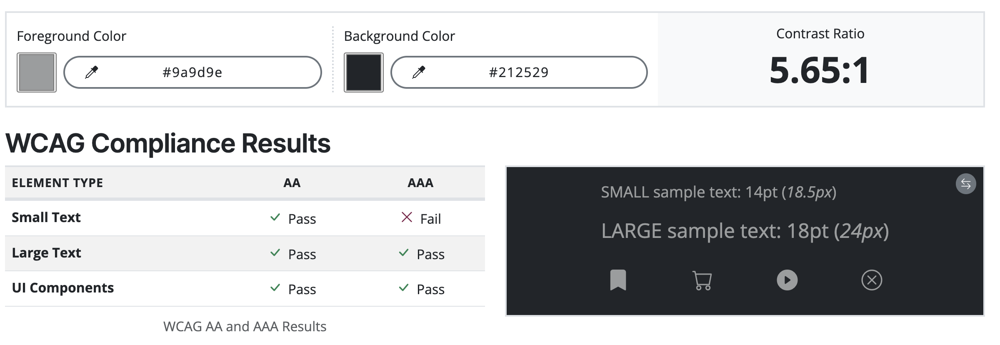

## **Vibe Verdicts**

PLACEHOLDER FOR DEPLOYED PROJECT LINK

PLACEHOLDER FOR IMAGE ON DEVICES

## **Site Overview**

Vibe Verdicts is an online application for music lovers to read and post reviews of their favourite music, or new music they have found. Users are able to see limited features of the site until they register an account, but when registered they are able to create, edit and delete their own reviews quickly and easily.

## **Table of contents** 

- [**Vibe Verdicts**](#vibe-verdicts)
- [**Site Overview**](#site-overview)
- [**Table of contents**](#table-of-contents)
- [**Planning stage**](#planning-stage)
  - [**Target Audiences**](#target-audiences)
  - [**User Stories**](#user-stories)
  - [**Site Aims**](#site-aims)
  - [**Wireframes**](#wireframes)
  - [**Color Scheme**](#color-scheme)
- [**Typography**](#typography)
- [**Features**](#features)
- [**Future Enhancements**](#future-enhancements)
- [**Testing Phase**](#testing-phase)
  - [**Responsiveness**](#responsiveness)
  - [**Functionality**](#functionality)
  - [**Validators**](#validators)
  - [**Lighthouse**](#lighthouse)
  - [**Testing user stories**](#testing-user-stories)
- [**Bugs**](#bugs)
- [**Deployment**](#deployment)
- [**Tech**](#tech)
- [**Credits**](#credits)
  - [**Content**](#content)
  - [**Media**](#media)

## **Planning stage**

### **Target Audiences**

- Users with an interest or love of any music
- Users who attend music festivals
- Users looking for new music to listen to
- Users thinking about getting into other genres of music

### **User Stories**

- As a user, I want the site to be easy to use.
- As a user, I want to the site to be responsive.
- As a user, I want the ability to read reviews posted by other users.
- As a user, I want the ability to post new reviews.
- As a user, I want the ability to read my own reviews.
- As a user, I want the ability to edit my own reviews.
- As a user, I want the ability to delete my own reviews.
- As a user, I want the ability to search for reviews by song or artist name.
- As a user, I want the ability to create an account.

### **Site Aims**

- Offer a simple to use application where users can create, read, edit and delete music reviews.
- Offer the ability to register an account, alloweing the user to see and manage their own reviews on a single page.
- To keep the user informed as they create, edit and delete reviews with confirmation of each step.
- To allow the user to search for reviews quickly and easily.

### **Wireframes**

Wireframes are all based on a central responsive design using bootstrap, so only desktop wireframes have been provided.

PLACEHOLDER WIREFRAME IMAGES NEEDED

### **Color Scheme**

Navbar and footer background #212529 Dark Grey
 
Secondary buttons: #6c757d Light grey
 
Supporting text: #585c5f Grey
 
Footer text: #9a9d9e Grey

The [WCAG Color Contrast Checker](https://accessibleweb.com/color-contrast-checker/) was used to ensure the grey text against the dark grey background met accessibility standards. All results passed, except for the small text in the AAA test. However, it was deemed acceptable, as the criteria for AAA compliance are exceptionally stringent and are rarely met.

## **Typography**

I decided to import the Oswald font from Google Fonts as I felt it had a modern vibe to it without compromising on readability. It's stylish, clear to read and worked well with all of the applications features.

## *Features**

**Features common to all pages**

Navigation - The navbar appears on every page of the application. However, the links shown in the image only appear when the user is logged in. If the user is not logged in, they will see Home, Login and Register. The nav bar is fully responsive and collapses inside of a 'burger' icon on smaller devices. If the user wishes to logout, they are prompted with a confirmation modal to ensure they didn't press it by mistake.

This feature helps the user as it gives them a clear, easy way to navigate around the website and find what they need.

Footer - The footer sticks to the bottom of the page, regardless of the page height, so on shorter pages, there is no white gap at the bottom of the page. It includes a contact email address if the user wishes to get in touch with Vibe Verdicts, and also links to their social media accounts. The colour scheme is consistent with the navbar to provide an aesthetic look.

This feature helps the user as they are able to get in touch with the website owner and look for more information and content on their social media accounts.

Flash messages - Flash messages, such as 'You are logged out. Bye for now!'  and various others are set to appear in the same place on every page (only when required/prompted via the app.py file). They appear above the first main heading of the page, below the nav bar, to keep consistency.

This feature helps the user as it keeps them informed as they navigate through and use the website. It also provides confirmation when they ask the website to perform a certain action, reassuring them that what they intended to happen, did in fact happen.

**Home Page**

Main crowd image - This is the first feature the user sees when they enter the website. It immediately fits the theme of the website, as it depicts a crowd at a live show gig. If the user isn't logged in, they see the register button and also a login prompt below if they already have an account. If the user is logged in, the button changes to 'Browse Reviews' and the login prompt is removed.

This feature helps the user because they have a quick way to register for an account and start reading and posting reviews if they haven't already registered, and also provides a quick way to browse reviews if they are logged in.

